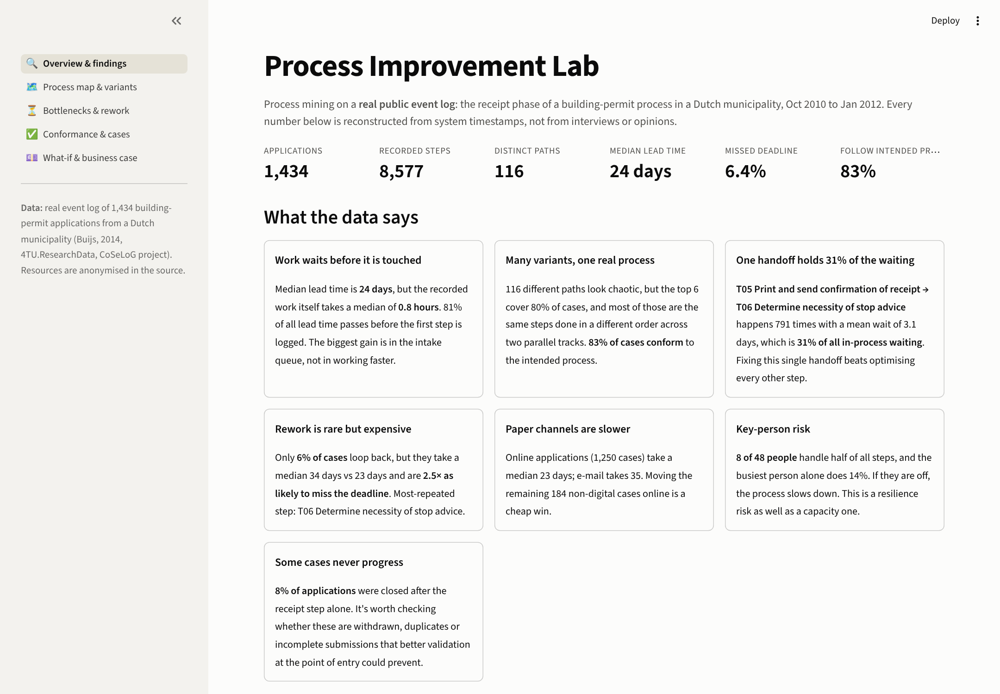
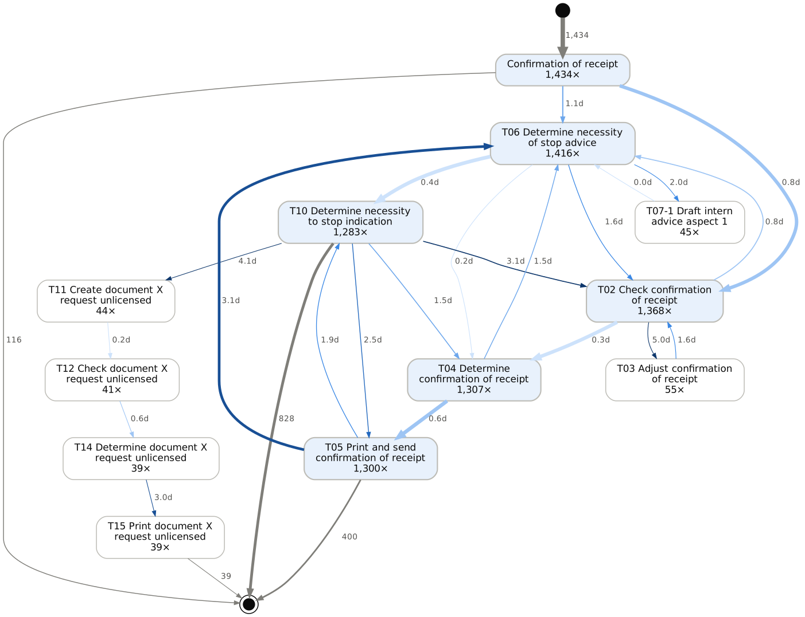
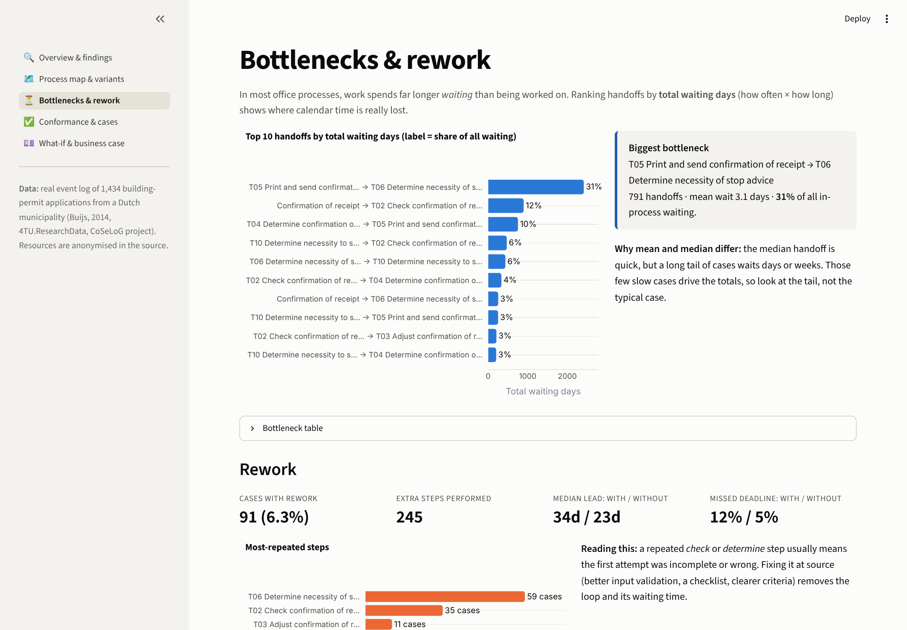
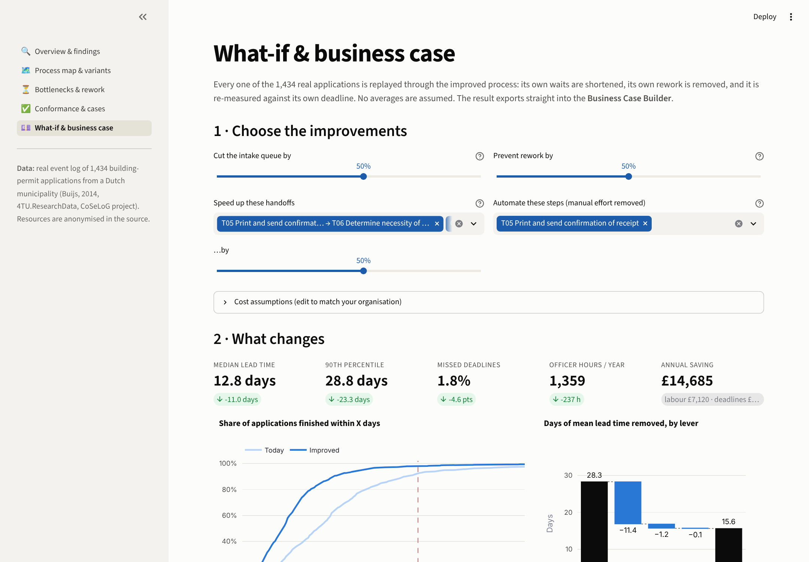

# Process Improvement Lab

**Process mining on a real public event log: find where time is lost, prove it with data, and turn the fix into a business case.**

Most process improvement starts with workshops and opinions about where the problems are. This project starts with the **system's own timestamps**. It reconstructs what actually happened to 1,434 real building-permit applications in a Dutch municipality, step by step, then answers four questions:

1. **How does the process really run?** An automatically discovered process map and its variants.
2. **Where is time lost?** Bottlenecks ranked by total waiting days, rework loops, slow channels, key-person risk.
3. **Does it follow the rules?** Every case checked against the intended process.
4. **What would fixing it be worth?** Every real case replayed through the improved process, with the savings exported to the [Business Case Builder](https://github.com/Divyaprakash-SM/business-case-builder).



---

## What the data says

| | Finding | So what |
|---|---|---|
| ⏳ | **81% of lead time passes before the first step is recorded.** Median lead time is 24 days, but the recorded work takes a median of under an hour. | Faster intake beats faster processing. Speeding up the work itself barely moves the total. |
| 🔀 | **116 variants, but the top 6 cover 80% of cases**, mostly the same steps in a different order across two parallel tracks. **83% conform** to the intended process. | The process is less chaotic than it looks. Focus on the exceptions, not a redesign. |
| 🚧 | **One handoff (T05 Print & send → T06 Stop advice) holds 31% of all in-process waiting**, with a mean wait of 3.1 days across 791 cases. | Fix one handoff, not ten. |
| 🔁 | **Only 6% of cases loop back, but they take 34 days vs 23 and are 2.5× as likely to miss the deadline.** | Rework is a quality problem first and a speed problem second. Validate at the point of entry. |
| ✉️ | **E-mail and post applications take 33–35 days vs 23 online.** | Moving the remaining 184 non-digital cases online is a cheap win. |
| 👤 | **8 of 48 people do half the work. The busiest person does 14% alone.** | Key-person risk: one absence slows the whole process. |

The process map, with arrows coloured and labelled by mean waiting time. The thick dark arrow is the bottleneck:



## The improvement case

The what-if page replays **each real application** under the proposed changes. Its own waits are shortened, its own rework removed, and it is re-checked against its own deadline. With a 50% cut in the intake queue, the top two handoffs sped up by 50%, half the rework prevented, and printed confirmations replaced by digital ones:

| | Today | Improved |
|---|---|---|
| Median lead time | 23.8 days | **12.8 days** |
| 90th percentile | 52.1 days | **28.8 days** |
| Missed deadlines | 6.4% | **1.8%** |
| Officer hours per year | 1,596 | **1,359** |

That is worth **about £14.7k a year** (labour plus avoided missed deadlines, at editable cost assumptions). One click exports it as an investment option into the Business Case Builder. Against a £20k implementation cost, it gives a risk-adjusted NPV of about £17k, which is *low value for money* on its own. That is an honest answer: the strongest case is to **roll the same fixes out across several similar processes**, not this one alone.

| | |
|---|---|
|  |  |

## Features

- **XES reader** for the IEEE standard event-log format, written from scratch with no process-mining library required.
- **Process discovery:** a directly-follows graph rendered with Graphviz, toggling between frequency and time views, with a noise filter.
- **Variant analysis:** a Pareto chart of paths and the share of cases each covers.
- **Bottleneck analysis:** handoffs ranked by *total* waiting days (frequency × wait), not just the average.
- **Rework analysis:** repeated steps and their effect on lead time and deadline compliance.
- **Conformance checking:** explicit, readable rules for the intended process (including parallel tracks that may interleave). Every case gets a verdict.
- **Case explorer:** the timeline of any individual application against its deadline.
- **Channel and workload analysis,** including workload concentration across people.
- **What-if simulation:** case-by-case replay with four levers and a waterfall showing what each lever contributes.
- **Business case export:** JSON that loads straight into the Business Case Builder.

## Run it

```bash
git clone https://github.com/Divyaprakash-SM/process-improvement-lab.git
cd process-improvement-lab
pip install -r requirements.txt
streamlit run app.py
```

```bash
pytest                                   # 20 tests: hand-checked toy log, conformance rules, simulation invariants
python -m lab.xes data/raw/receipt.xes   # rebuild the CSVs from the raw log (or point it at your own .xes)
```

## How it's built

```
process-improvement-lab/
├── app.py               # navigation
├── views/               # one file per page
├── lab/
│   ├── xes.py           # XES -> tidy events / cases tables
│   ├── mining.py        # DFG, variants, bottlenecks, rework, conformance, workload
│   ├── whatif.py        # case-by-case replay, labour cost model, business case export
│   └── insights.py      # headline findings written from the data
├── data/                # events.csv, cases.csv, raw/receipt.xes
└── tests/
```

**Design choices**
- **No black boxes.** Process-mining libraries exist, but every metric here is a few lines of readable pandas, so each number can be explained in an interview.
- **Totals over averages.** A handoff that is usually instant but sometimes takes weeks is invisible to a median. Ranking by total waiting days surfaces it.
- **Replay, don't assume.** The what-if applies changes to each real case's own timeline rather than multiplying an average by a guessed percentage.
- **Honest caveats.** The log records when steps *finished*, not hands-on effort, so effort minutes are labelled as editable assumptions. The meaning of the "start date" field isn't documented in the source, so the intake queue is flagged as the first question for the process owner.

**Stack:** Python · pandas · NumPy · Plotly · Graphviz · Streamlit · pytest

## Data

Buijs, J.C.A.M. (2014). *Receipt phase of an environmental permit application process ("WABO"), CoSeLoG project.* Eindhoven University of Technology. 4TU.ResearchData. [doi:10.4121/uuid:a07386a5-7be3-4367-9535-70bc9e77dbe6](https://doi.org/10.4121/uuid:a07386a5-7be3-4367-9535-70bc9e77dbe6). Real-life log from an anonymous Dutch municipality; staff identities are anonymised in the source.

## Deploy free

[share.streamlit.io](https://share.streamlit.io) → **Create app** → pick this repo, branch `main`, file `app.py` → **Deploy**. Graphviz renders in the browser, so no system packages are needed.

---

**Divyaprakash S M** · PMP · PRINCE2 Agile Practitioner · MSc Business Analytics (University of Southampton)
